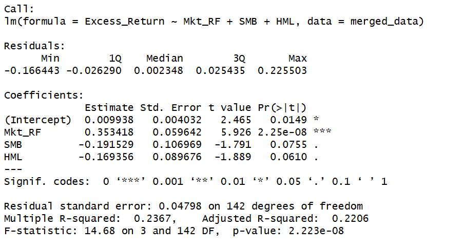
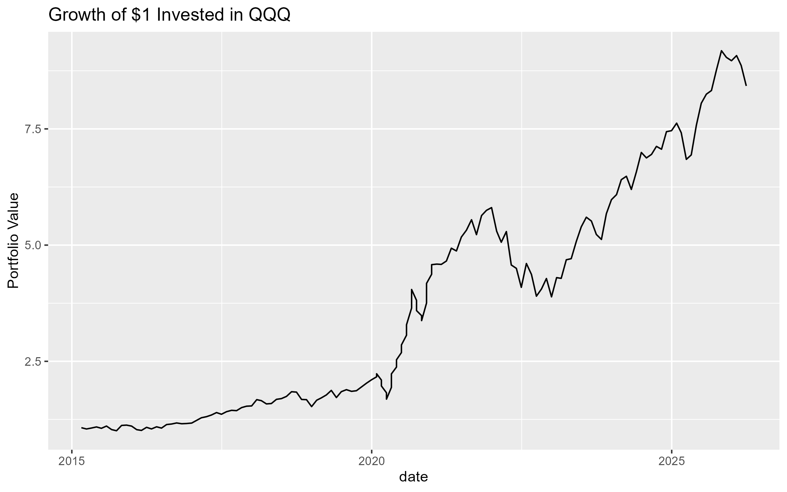
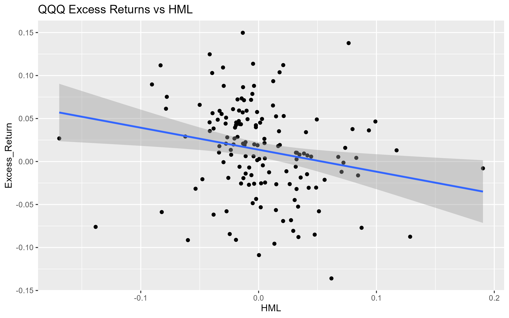
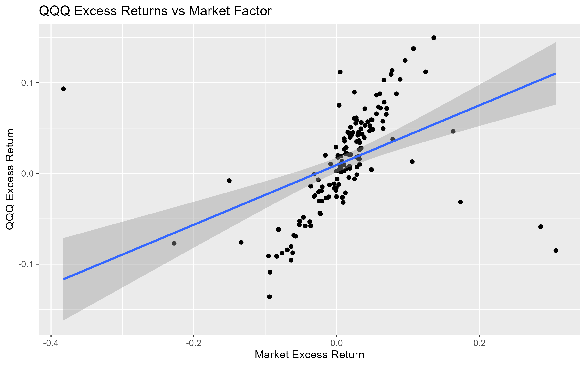
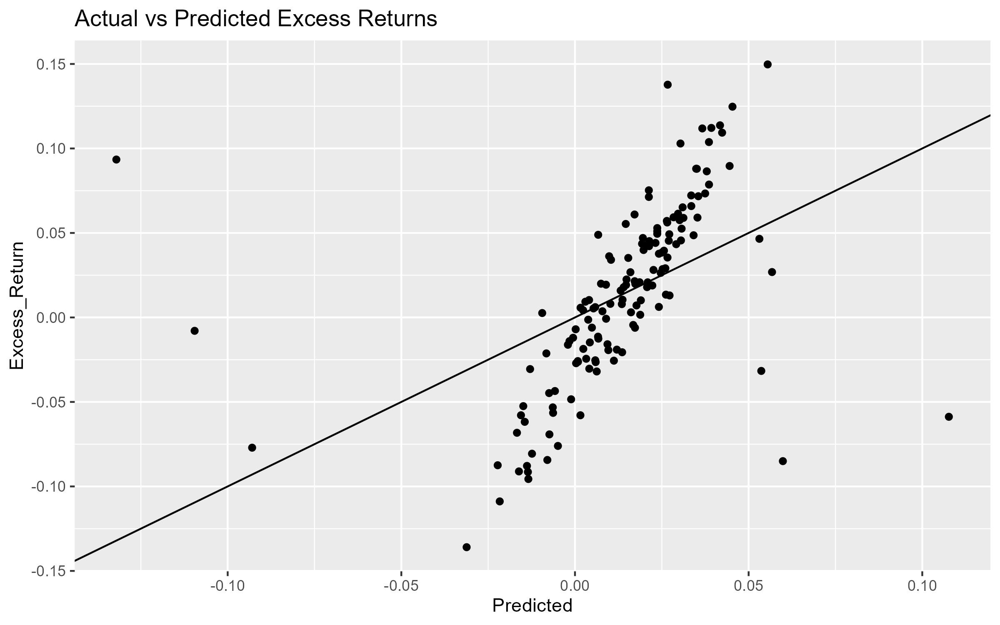

# Fama-French Factor Analysis of QQQ Returns

This project analyzes the monthly returns of the Invesco QQQ ETF using the Fama-French three-factor model in R.

The goal is to examine how market, size, and value factors help explain the behavior of QQQ returns over time.

---

## Project Overview

The project includes:

- Downloading historical QQQ price data using Yahoo Finance
- Computing monthly returns
- Importing Fama-French factor data
- Merging and cleaning financial datasets
- Running a multiple linear regression using the Fama-French three-factor model
- Visualizing return behavior and factor relationships

---

## Data Sources

### QQQ Market Data
- Source: Yahoo Finance
- Ticker: QQQ
- Time Period: 2015–2024

### Fama-French Factors
- Source: Kenneth French Data Library
- Factors Used:
  - Market Risk Premium (`Mkt_RF`)
  - SMB (Small Minus Big)
  - HML (High Minus Low)
  - Risk-Free Rate (`RF`)

---

## Methodology

Monthly excess returns for QQQ are calculated as:

```math
Excess\ Return = QQQ\ Return - RF
```

The following regression model is estimated:

```math
Excess\ Return = \alpha + \beta_1(Mkt\_RF) + \beta_2(SMB) + \beta_3(HML) + \epsilon
```

The model is fit using ordinary least squares (OLS) regression in R.

---

## Key Findings

- QQQ shows statistically significant exposure to the overall market factor.
- Negative SMB loading suggests QQQ behaves more like large-cap stocks.
- Negative HML loading is consistent with QQQ’s growth-oriented technology composition.
- The model explains a meaningful portion of variation in monthly excess returns.

---

## Regression Results

The regression output shows that QQQ has statistically significant exposure to the overall market factor, while exhibiting negative exposure to SMB and HML factors, which is consistent with a large-cap growth-oriented ETF.



## Visualizations

### Growth of $1 Invested in QQQ



### QQQ Excess Returns vs HML



### QQQ Excess Returns vs Market Factor



### Actual vs Predicted Excess Returns



---

## Technologies Used

- R
- tidyverse
- quantmod
- PerformanceAnalytics
- ggplot2
- lubridate
- broom

---

